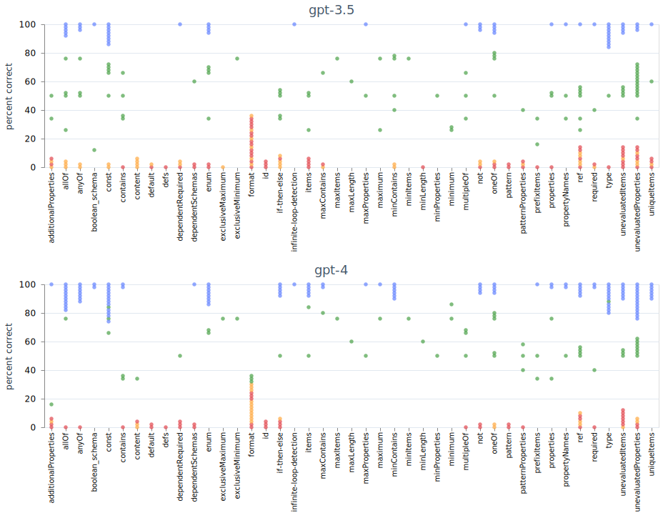
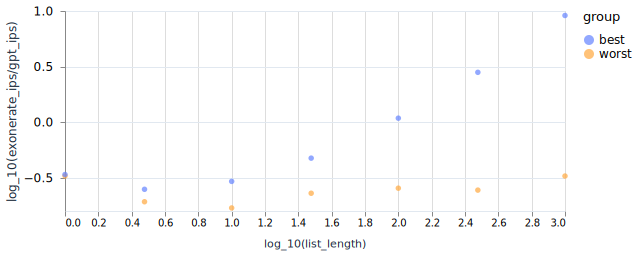

<!-- livebook:{"persist_outputs":true} -->

# Should I use GPT to autogenerate schema validations?

> This md file can be run as a livebook found at the following location:
> The full chart has interactive tooltips not available in the "non-live"
> markdown form.
>
> https://github.com/E-xyza/Exonerate/blob/master/bench/gpt-bench.livemd
>
> For more information on livebook see: https://livebook.dev/

```elixir
Mix.install([
  {:jason, "> 0.0.0"},
  {:vega_lite, "~> 0.1.7"},
  {:kino_vega_lite, "~> 0.1.8"},
  {:benchee, "~> 1.1.0"},
  {:exonerate, "~> 0.3.0"}
])

~w(test.ex schema.ex)
|> Enum.each(fn file ->
  __DIR__
  |> Path.join("benchmark/#{file}")
  |> Code.compile_file()
end)

alias Benchmark.Schema
alias Benchmark.Test
```

## Motivation

This entire month (March, 2023), I had been spending a ton of effort completing a major
refactor of my json-schema library for Elixir.  As I was toiling away handcrafting macros to 
generate optimized, bespoke, yet generalizable code, GPT-4 rolled onto the scene and awed all of
us in the industry with its almost magical ability to craft code out of whole cloth.  I felt a
little bit like John Henry battling against the iron tracklayer, only to win but expire from his exertion. 

With the advent of LLM-based code generation, we are seeing programmers leveraging the power of
LLMs, such as GPT, to generate difficult or fussy code and rapidly create code.  Is this a good
idea?  I wanted to test this out.

Note that compared to a schema compiler, LLM-generated code may be able to see some nice
optimizations for simple schemas.  This is roughly equivalent to a human claiming to be able to
write better assembly language than a low-level language compiler.  In some cases, the human
may access extra knowledge about the structure of the data being handled, and thus the claim
may be justified.

On the other hand, JSONSchema validations are typically used at the edge of a system,
especially when interfacing with a 3rd party system (or human) with QC that is not under the
control of the publisher of the JSONSchema.  In these situations, strict adherence to JSONSchema
is desirable.  An early 422 rejection with a reason explaining where the data are misshapen is
generally more desirable than a typically more opaque 500 rejection because the data do not
match the expectations of the internal system.

With these considerations, I decided to test just how good GPT is at writing JSONSchemas, and
answer the question **"Should I use GPT to autogenerate schema validations?"**

## Methodology

To test this question, the following prompt was generated against ~> 250 JSONSchemas provided 
as a part of the JSONSchema engine validation suite (https://github.com/json-schema-org/JSON-Schema-Test-Suite).  
Each of these was injected into the following templated query and GPT3.5 and GPT4 were asked
to provide a response.

````
Hi, ChatGPT! I would love your help writing an Elixir public function `validate/1`, which takes
one parameter, which is a decoded JSON value.  The function should return :ok if the following
jsonschema validates, and an error if it does not:

```
#{schema}
```

The function should NOT store or parse the schema, it should translate the instructions in the schema directly as
elixir code.  For example:

```
{"type": "object"}
```

should emit the following code:

```
def validate(object) when is_map(object), do: :ok
def validate(_), do: :error
```

DO NOT STORE THE SCHEMA or EXAMINE THE SCHEMA anywhere in the code.  There should not be any
`schema` variables anywhere in the code.  please name the module with the atom `:"#{group}-#{title}"

Thank you!
````

From the response, the code inside of the elixir fenced block was extracted and saved into a .exs file for processing as below in this live notebook.  GPT-3.5 was not capable of correctly wrapping the elixir module, so it required an automated result curation step; GPT-4 code was able to be used as-is.  Some further manual curation was performed (see Systematic code generation issues.)

## Limitations

The biggest limitation of this approach is the nature of the examples provided in the JSONSchema validation suite.  These validations exist to help JSONSchema implementers understand "gotchas" in the JSONSchema standard.  As such, they don't feature "real-world" payloads and their complexity is mostly limited to testing a single JSONSchema filter, in some cases, a handful of JSONSchema filters, where the filters have a long-distance interaction as part of the specification.

As a result, the optimizations that GPT performs may not really be scalable to real-world cases, and it's not clear if GPT will have sufficient attention to handle the more complex cases.

Future studies, possibly involving schema generation and a property testing approach, can yield a more comprehensive understanding of GPT code generation

Note that the source data for GPT is more heavily biased towards imperative programming languages, so despite the claim that AI-assisted code-generation is likely to be more fruitful for languages (like Elixir) with term-immutability, any deficiencies in the code may also be a result of a deficiency in the LLM's understanding of Elixir.

## Benchmarking Accuracy

We're going to marshal our results into the following struct, which carries information for
visualization:

```elixir
defmodule Benchmark.Result do
  @enforce_keys [:schema, :type]
  defstruct @enforce_keys ++ [fail: [], pass: [], pct: 0.0, exception: nil]
end
```

<!-- livebook:{"output":true} -->

The following code is used to profile our GPT-generated code.  The directory structure is
expected to be that of the https://github.com/E-xyza/exonerate repository, and this notebook is
expected to be in the ./bench/, otherwise the relative directory paths won't work.

Note that the Schema and Test modules should be in `./bench/benchmark/schema.ex` and
`./bench/benchmark/test.ex`, respectively, these are loaded in the dependencies section.

```elixir
defmodule Benchmark do
  alias Benchmark.Result

  @omit ~w(anchor.json refRemote.json dynamicRef.json)

  @test_directory Path.join(__DIR__, "../test/_draft2020-12")
  def get_test_content do
    Schema.stream_from_directory(@test_directory, omit: @omit)
  end

  def run(gpt, test_content) do
    code_directory = Path.join(__DIR__, gpt)

    test_content
    |> Stream.map(&compile_schema(&1, code_directory))
    |> Stream.map(&evaluate_test/1)
    |> Enum.to_list()
  end

  defp escape(string), do: String.replace(string, "/", "-")

  defp compile_schema(schema, code_directory) do
    filename = "#{schema.group}-#{escape(schema.description)}.exs"
    code_path = Path.join(code_directory, filename)

    module =
      try do
        {{:module, module, _, _}, _} = Code.eval_file(code_path)
        module
      rescue
        error -> error
      end

    {schema, module}
  end

  defp evaluate_test({schema, exception}) when is_exception(exception) do
    %Result{schema: schema, type: :compile, exception: exception}
  end

  defp evaluate_test({schema, module}) do
    # check to make sure module exports the validate function.
    if function_exported?(module, :validate, 1) do
      increment = 100.0 / length(schema.tests)

      schema.tests
      |> Enum.reduce(%Result{schema: schema, type: :ok}, fn test, result ->
        expected = if test.valid, do: :ok, else: :error

        try do
          if module.validate(test.data) === expected do
            %{result | pct: result.pct + increment, pass: [test.description | result.pass]}
          else
            %{result | type: :partial, fail: [{test.description, :incorrect} | result.fail]}
          end
        rescue
          e ->
            %{result | type: :partial, fail: [{test.description, e} | result.fail]}
        end
      end)
      |> set_total_failure
    else
      %Result{schema: schema, type: :compile, exception: :not_generated}
    end
  end

  # if absolutely none of the answers is correct, then set the type to :failure
  defp set_total_failure(result = %Result{pct: 0.0}), do: %{result | type: :failure}
  defp set_total_failure(result), do: result
end

tests = Benchmark.get_test_content()

gpt_3_results = Benchmark.run("gpt-3.5", tests)
gpt_4_results = Benchmark.run("gpt-4", tests)

:ok
```

## Systematic Issues

### Atoms vs. Strings

Both GPT-3.5 and GPT-4 sometimes use atoms in their code instead of strings.  This is
understandable, since various Elixir JSON implementations may use atoms instead of strings
in the internal representation of JSON, especially for object keys.  However, validation of
JSON is most likely going to operate on string keys, since atom keys for input is discouraged
due to security concerns.  Here is some example code that GPT-4 generated:

<!-- livebook:{"force_markdown":true} -->

```elixir
defmodule :"oneOf-oneOf complex types" do
  def validate(object) when is_map(object) do
    case Enum.filter([:bar, :foo], &Map.has_key?(object, &1)) do
      [:bar] ->
        case Map.fetch(object, :bar) do
          {:ok, value} when is_integer(value) -> :ok
          _ -> :error
        end
      [:foo] ->
        case Map.fetch(object, :foo) do
          {:ok, value} when is_binary(value) -> :ok
          _ -> :error
        end
      _ -> :error
    end
  end

  def validate(_), do: :error
end
```

Code featuring atom keys in maps was manually converted prior to benchmarking accuracy, for
example, the above code is converted to:

<!-- livebook:{"force_markdown":true} -->

```elixir
defmodule :"oneOf-oneOf complex types" do
  def validate(object) when is_map(object) do
    case Enum.filter(["bar", "foo"], &Map.has_key?(object, &1)) do
      ["bar"] ->
        case Map.fetch(object, "bar") do
          {:ok, value} when is_integer(value) -> :ok
          _ -> :error
        end
      ["foo"] ->
        case Map.fetch(object, "foo") do
          {:ok, value} when is_binary(value) -> :ok
          _ -> :error
        end
      _ -> :error
    end
  end

  def validate(_), do: :error
end
```

### String length is UTF-8 grapheme count

Neither GPT understood that the JSONSchema string length count counts UTF-8 graphemes.  As an
example, GPT-4 produced the following code:

<!-- livebook:{"force_markdown":true} -->

```elixir
defmodule :"maxLength-maxLength validation" do
  def validate(string) when is_binary(string) do
    if byte_size(string) <= 2, do: :ok, else: :error
  end

  def validate(_), do: :error
end
```

Instead, the if statement should have been:

<!-- livebook:{"force_markdown":true} -->

```elixir
if String.length(string) <= 2, do: :ok, else: :error
```

### Integers need to match Floats

The JSONSchema standard requires that constant integers, enumerated integers, and floating
point numbers must match as integers.  In elixir, while the `==` operator will resolve as true
when comparing an integral floating point, other operations, such as matching, will not.  Both 
GPT-3.5 and GPT-4 struggled with this.  GPT-4 missed several validations due to this.

#### Example:

<!-- livebook:{"force_markdown":true} -->

```elixir
defmodule :"enum-enum with 0 does not match false" do
  def validate(0), do: :ok
  def validate(_), do: :error
end
```

### Filters only apply to their own types

This common error, which is common to both GPT-3.5 and GPT-4, stems because GPT does not
understand that a filter will not reject a type it is not designed to operate on.  A good
example of such code is the following (derived from the schema `{"maxItems": 2}`):

<!-- livebook:{"force_markdown":true} -->

```elixir
defmodule :"maxItems-maxItems validation" do
  def validate(list) when is_list(list) and length(list) <= 2, do: :ok
  def validate(_), do: :error
end
```

GPT-4 will Note that `validate/1` will return `:error` when confronted with a string, even 
though the JSONSchema spec says that the `maxItems` filter should not apply, defaulting to
successful validation.

When given the schema `{"maxItems": 2, "maxLength": 4}` (not in the test suite), GPT-4 does
something even stranger, applying the `maxLength` criterion to the inner elements of the list, 
even while accepting the that the outer element can be either a list or a string.

<!-- livebook:{"force_markdown":true} -->

```elixir
defmodule :"maxItems-maxLength" do
  def validate(value) when is_list(value) and length(value) <= 2 do
    Enum.reduce(value, :ok, fn item, acc ->
      if is_binary(item) and byte_size(item) <= 4, do: acc, else: :error
    end)
  end

  def validate(value) when is_binary(value) and byte_size(value) <= 4 do
    :ok
  end

  def validate(_), do: :error
end
```

When given `{"maxLength": 4, "maximum": 3}`, GPT-4 gets the code correct.

<!-- livebook:{"force_markdown":true} -->

```elixir
defmodule :"maxLength-maximum" do
  def validate(value) when is_binary(value) and byte_size(value) <= 4, do: :ok
  def validate(value) when is_number(value) and value <= 3, do: :ok
  def validate(_), do: :error
end
```

In the GPT-4 accuracy benchmark, ~15 of the test schemas were prevented from passing all of
their tests solely because of missing this criterion.

### Format/Content

Neither GPT knew that `format` and `content-*` filters are default off and the test suite does
not test against this validation.  However, both GPTs reached for Elixir standard library
tools, even though these do not necessarily fit the explicit requirements set forth by the
JSONSchema standard, or 3rd party tools (despite being told explictly not to) to perform
validations.

#### Examples (all GPT-4):

<!-- livebook:{"force_markdown":true} -->

```elixir
defmodule :"format-validation of date-time strings" do
  def validate(datetime_string) when is_binary(datetime_string) do
    if valid_datetime?(datetime_string) do
      :ok
    else
      :error
    end
  end

  def validate(_), do: :error

  defp valid_datetime?(datetime_string) do
    case DateTime.from_iso8601(datetime_string) do
      {:ok, _} -> true
      :error -> false
    end
  end
end
```

For `date-time` validation, the correct Elixir Standard Library to use is `NaiveDateTime`, not
`DateTime`.  `DateTime` will fail without being given time-zone information.

<!-- livebook:{"force_markdown":true} -->

```elixir
defmodule :"format-validation of IDN hostnames" do
  alias :idna, as: Idna

  def validate(hostname) when is_binary(hostname) do
    if valid_idn_hostname?(hostname) do
      :ok
    else
      :error
    end
  end

  def validate(_), do: :error

  defp valid_idn_hostname?(hostname) do
    case Idna.to_ascii(hostname) do
      {:ok, ascii_hostname} -> valid_ascii_hostname?(ascii_hostname)
      _ -> false
    end
  end

  defp valid_ascii_hostname?(hostname) do
    :inet.parse_strict_address(hostname) == :error and
      Enum.all?(String.split(hostname, ".", trim: true), &valid_label?/1)
  end

  defp valid_label?(label) do
    byte_size(label) in 1..63 and
      String.match?(label, ~r/^[a-zA-Z0-9]([a-zA-Z0-9-]*[a-zA-Z0-9])?$/)
  end
end
```

GPT-4 (impressively) reaches for the :idna erlang library, but, oddly decides to alias it with
an Elixir-style module name.

## Accuracy Evaluation

Next, let's look at how accurately GPT-3.5 and GPT-4 perform across all of the JSONSchema tests:

```elixir
defmodule Benchmark.Plotter do
  def format_passes(result) do
    result.pass
    |> Enum.map(&"✅ #{&1}")
    |> Enum.join("\n")
  end

  def format_fails(result) do
    result.fail
    |> Enum.map(&"❌ #{elem(&1, 0)}")
    |> Enum.join("\n")
  end

  @granularity 2

  def tabularize(result) do
    color =
      case result.type do
        :ok -> :green
        :partial -> :yellow
        :failure -> :orange
        :compile -> :red
      end

    %{
      group: result.schema.group,
      test: result.schema.description,
      schema: Jason.encode!(result.schema.schema),
      pct: round(result.pct / @granularity) * @granularity,
      color: color,
      pass: format_passes(result),
      fail: format_fails(result)
    }
  end

  def nudge_data(results) do
    # data points might overlap, so to make the visualization more effective,
    # we should nudge the points apart from each other.
    results
    |> Enum.sort_by(&{&1.group, &1.pct})
    |> Enum.map_reduce(MapSet.new(), &nudge/2)
    |> elem(0)
  end

  @nudge 2

  # points might overlap, so move them up or down accordingly for better 
  # visualization.  Colors help us understand the qualitative results.
  defp nudge(result = %{pct: pct}, seen) when pct == 100, do: nudge(result, seen, -@nudge)
  defp nudge(result, seen), do: nudge(result, seen, @nudge)

  defp nudge(result, seen, amount) do
    if {result.group, result.pct} in seen do
      nudge(%{result | pct: result.pct + amount}, seen, amount)
    else
      {result, MapSet.put(seen, {result.group, result.pct})}
    end
  end

  def plot_one({title, results}) do
    tabularized =
      results
      |> Enum.map(&tabularize/1)
      |> nudge_data

    VegaLite.new(title: title)
    |> VegaLite.data_from_values(tabularized)
    |> VegaLite.mark(:circle)
    |> VegaLite.encode_field(:x, "group", type: :nominal, title: false)
    |> VegaLite.encode_field(:y, "pct", type: :quantitative, title: "percent correct")
    |> VegaLite.encode_field(:color, "color", legend: false)
    |> VegaLite.encode(:tooltip, [
      [field: "group"],
      [field: "test"],
      [field: "schema"],
      [field: "pass"],
      [field: "fail"]
    ])
  end

  def plot(list_of_results) do
    VegaLite.new()
    |> VegaLite.concat(Enum.map(list_of_results, &plot_one/1), :vertical)
  end
end

Benchmark.Plotter.plot("gpt-3.5": gpt_3_results, "gpt-4": gpt_4_results)
```

<!-- livebook:{"output":true} -->




In the above chart, blue dots are 100% correct, green dots are partially correct, orange dots
are completely incorrect, and red dots are compilation errors.  Note that dot positions may
not be at the exact percentage, so that the count of overlapping tests can be easily seen.

## Selected Observations of interest

### Incorrect Elixir

GPT-3.5 and GPT-4 are not aware that only certain functions can be called in function guards,
so this example from GPT-4 causes a compilation error:

<!-- livebook:{"force_markdown":true} -->

```elixir
defmodule :"anyOf-anyOf with base schema" do
  def validate(value) when is_binary(value) and (String.length(value) <= 2 or String.length(value) >= 4), do: :ok
  def validate(_), do: :error
end
```

### Misunderstanding Elixir

GPT-4 attempts to directly match the result of `Map.keys/1`.  (see second function header)  This likely works
in this case, but in general there is no guarantee that the list result of this function will return the
keys in any given order see: https://www.erlang.org/doc/man/maps.html#keys-1.

<!-- livebook:{"force_markdown":true} -->

```elixir
defmodule :"oneOf-oneOf with missing optional property" do
  def validate(%{"foo" => _} = object) do
    case Map.keys(object) do
      ["foo"] -> :ok
      _ -> :error
    end
  end
  def validate(%{"bar" => _} = object) do
    case Map.keys(object) do
      ["bar", "baz"] -> :ok
      _ -> :error
    end
  end
  def validate(_), do: :error
end
```

GPT-3 also often attempts to match from `Map.keys/1`:

<!-- livebook:{"force_markdown":true} -->

```elixir
defmodule :"unevaluatedProperties-nested unevaluatedProperties, outer false, inner true, properties inside-gpt-3.5" do
  def validate(object) when is_map(object) do
    case Map.keys(object) do
      ["foo" | _] -> :ok
      _ -> :error
    end
  end

  def validate(_) do
    :error
  end
end
```

in this case simply

<!-- livebook:{"force_markdown":true} -->

```elixir
if Map.has_key?(object, "foo"), do: :ok, else: :error
```

would have done the trick.

### Hallucinations

GPT-3.5 was particularly prone to hallucinations.  In one case, it hallucinated a `json_schema` 
library (and also flubbed the parameter it passed):

<!-- livebook:{"force_markdown":true} -->

```elixir
defmodule :"items-prefixItems with no additional items allowed-gpt-3.5" do
  def validate(object) when is_map(object), do: validate_object(object)
  def validate(_), do: :error

  defp validate_object(object) do
    case Map.has_key?(object, :items) and Map.has_key?(object, :prefixItems) and not Map.has_key?(object, :additionalItems) do
      true -> Map.get(object, :prefixItems)
              |> Enum.all?(fn _ -> %{} end)
              |> :json_schema.validate(:#{false})
              |> handle_validation_result()
      false -> :error
    end
  end

  defp handle_validation_result(result) do
    case result do
      {:ok, _} -> :ok
      {:error, _, _} -> :error
    end
  end
end
```

### Semantic misunderstanding

```json
{"contains":{"maximum": 5}}
```

GPT-4 misinterprets OpenAPI and generates the following code:

<!-- livebook:{"force_markdown":true} -->

```elixir
defmodule :"contains-contains keyword validation" do
  def validate(object) when is_list(object) do
    if Enum.count(object) >= 5 do
      :ok
    else
      :error
    end
  end
  def validate(_), do: :error
end
```

This would be the correct code for:

```json
{"contains": {}, "maxContains": 5}
```

But the semantic error that GPT-4 makes is that it thinks that "maximum" is a qualifier on
"contains", when in fact the schema calls for a new "context"; each object in the list should
validate as `{"maximum": 5}` but this doesn't apply to the list itself.

### Completely misunderstanding

Several times, GPT-3.5 gave up on doing the task properly and instead wandered off into
matching the schema, despite being told explictly not to.  Here is the simplest example:

<!-- livebook:{"force_markdown":true} -->

```elixir
defmodule :"uniqueItems-uniqueItems=false validation-gpt-3.5" do
  @moduledoc "Validates a JSON object against the 'uniqueItems=false' schema.\n"
  @doc "Validates the given JSON object against the schema.\n"
  @spec validate(Map.t()) :: :ok | :error
  def validate(%{uniqueItems: false} = object) when is_list(object) do
    if Enum.uniq(object) == object do
      :ok
    else
      :error
    end
  end

  def validate(_) do
    :error
  end
end
```

## Selected Performance Comparisons

Using the Benchee library, here I set up a framework by which we can test the speed of a few 
representative samples of generated code.  The "John Henry" contender will be Exonerate, the 
Elixir library that this notebook lives in.  Here we set up a `compare/2` function that runs 
Benchee and reports the winner (ips = invocations per second, **bigger is better**).  The 
module will also host the code generated by Exonerate.

```elixir
defmodule ExonerateBenchmarks do
  require Exonerate

  def compare(scenario, value, raw \\ false) do
    [exonerate_ips, gpt_ips] =
      %{
        gpt4: fn -> apply(scenario, :validate, [value]) end,
        exonerate: fn -> apply(__MODULE__, scenario, [value]) end
      }
      |> Benchee.run()
      |> Map.get(:scenarios)
      |> Enum.sort_by(& &1.name)
      |> Enum.map(& &1.run_time_data.statistics.ips)

    cond do
      raw ->
        exonerate_ips / gpt_ips

      gpt_ips > exonerate_ips ->
        "gpt-4 faster than exonerate by #{gpt_ips / exonerate_ips}x"

      true ->
        "exonerate faster than gpt-4 by #{exonerate_ips / gpt_ips}x"
    end
  end

  Exonerate.function_from_string(
    :def,
    :"allOf-allOf simple types",
    ~S({"allOf": [{"maximum": 30}, {"minimum": 20}]})
  )

  Exonerate.function_from_string(
    :def,
    :"uniqueItems-uniqueItems validation",
    ~S({"uniqueItems": true})
  )

  Exonerate.function_from_string(
    :def,
    :"oneOf-oneOf with required",
    ~S({
            "type": "object",
            "oneOf": [
                { "required": ["foo", "bar"] },
                { "required": ["foo", "baz"] }
            ]
        })
  )
end
```

### GPT-4 wins!

```json
{"allOf": [{"maximum": 30}, {"minimum": 20}]}
```

Let's take a look at a clear case where GPT-4 is the winning contender.  In this code, we apply 
two filters to a number using the allOf construct so that the number is subjected to both
schemata.  This would not be the best way to do this (probably doing this without allOf is
better) but it will be very illustrative of how GPT-4 can do better.

This is GPT-4's code:

<!-- livebook:{"force_markdown":true} -->

```elixir
def validate(number) when is_number(number) do
  if number >= 20 and number <= 30 do
    :ok
  else
    :error
  end
end

def validate(_), do: :error
```

Holy moly.  GPT-4 was able to deduce the intent of the allOf and see clearly that the filters
collapse into a single set of conditions that can be checked without indirection.

By contrast, this is what Exonerate creates:

<!-- livebook:{"force_markdown":true} -->

```elixir
def validate(data) do
  unquote(:"function://validate/#/")(data, "/")
end

defp unquote(:"function://validate/#/")(array, path) when is_list(array) do
  with :ok <- unquote(:"function://validate/#/allOf")(array, path) do
    :ok
  end
end
defp unquote(:"function://validate/#/")(boolean, path) when is_boolean(boolean) do
  with :ok <- unquote(:"function://validate/#/allOf")(boolean, path) do
    :ok
  end
end
defp unquote(:"function://validate/#/")(integer, path) when is_integer(integer) do
  with :ok <- unquote(:"function://validate/#/allOf")(integer, path) do
    :ok
  end
end
defp unquote(:"function://validate/#/")(null, path) when is_nil(null) do
  with :ok <- unquote(:"function://validate/#/allOf")(null, path) do
    :ok
  end
end
defp unquote(:"function://validate/#/")(float, path) when is_float(float) do
  with :ok <- unquote(:"function://validate/#/allOf")(float, path) do
    :ok
  end
end
defp unquote(:"function://validate/#/")(object, path) when is_map(object) do
  with :ok <- unquote(:"function://validate/#/allOf")(object, path) do
    :ok
  end
end
defp unquote(:"function://validate/#/")(string, path) when is_binary(string) do
  if String.valid?(string) do
    with :ok <- unquote(:"function://validate/#/allOf")(string, path) do
      :ok
    end
  else
    require Exonerate.Tools
    Exonerate.Tools.mismatch(string, "function://validate/", ["type"], path)
  end
end
defp unquote(:"function://validate/#/")(content, path) do
  require Exonerate.Tools
  Exonerate.Tools.mismatch(content, "function://validate/", ["type"], path)
end

defp unquote(:"function://validate/#/allOf")(data, path) do
  require Exonerate.Tools

  Enum.reduce_while([
    &unquote(:"function://validate/#/allOf/0")/2, 
    &unquote(:"function://validate/#/allOf/1")/2
    ], 
    :ok, 
    fn fun, :ok ->
      case fun.(data, path) do
        :ok -> {:cont, :ok}
        Exonerate.Tools.error_match(error) -> {:halt, error}
      end
  end)
end

defp unquote(:"function://validate/#/allOf/0")(integer, path) when is_integer(integer) do
  with :ok <- unquote(:"function://validate/#/allOf/0/maximum")(integer, path) do
    :ok
  end
end

# ... SNIP ...

defp unquote(:"function://validate/#/allOf/1/minimum")(number, path) do
  case number do
    number when number >= 20 ->
      :ok

    _ ->
      require Exonerate.Tools
      Exonerate.Tools.mismatch(number, "function://validate/", ["allOf", "1", "minimum"], path)
  end
end
```

It was so long I had to trim it down to keep from boring you.  But you should be able to get 
the point.  The exonerate code painstakingly goes through every single branch of the schema
giving it its own, legible function and when there's an error it also goes ahead and 
annotates the location in the schema where the error occurred, and what filter the input
violated.  So it's legitimately doing *more* than what the GPT-4 code does, which gleefully
destroyed this information that could be useful to whoever is trying to send data.

Then again, I didn't *ask* it to do that.  Let's see how much of a difference in performance
all this makes

```elixir
ExonerateBenchmarks.compare(:"allOf-allOf simple types", 25)
```

<!-- livebook:{"output":true} -->

```
"gpt-4 faster than exonerate by 2.2903531909721173x"
```

So above, we see that gpt-4 is ~>2x faster than exonerate.  John Henry is defeated, in this round.

### Hidden Regressions

`{"uniqueItems": true}`

Next, let's take a look at a place where a quick glance at the GPT-4 code creates a
tough-to-spot regression, in a very simple filter.  Here, GPT-4 does an obvious thing:

<!-- livebook:{"force_markdown":true} -->

```elixir
def validate(list) when is_list(list) do
  unique_list = Enum.uniq(list)

  if length(list) == length(unique_list) do
    :ok
  else
    :error
  end
end
```

If you're not familiar with how the BEAM works, the regression occurs because `Enum.uniq()` is 
O(N) in the length of the list; `length(...)` is O(N) as well, so in the worst case this
algorithm runs through the length of the list *three* times.

I won't show you the code Exonerate generated, but suffice it to say, the validator only loops 
through the list once.  And it even quits early if it encounters a uniqueness violation.

When we give it a short list, GPT-4 wins still.

```elixir
ExonerateBenchmarks.compare(:"uniqueItems-uniqueItems validation", [1, 2, 3])
```

<!-- livebook:{"output":true} -->

```
"gpt-4 faster than exonerate by 5.284881178051852x"
```

but, given a longer list, we see that exonerate will win out.

```elixir
input = List.duplicate(1, 1000)
ExonerateBenchmarks.compare(:"uniqueItems-uniqueItems validation", input)
```

```
"exonerate faster than gpt-4 by 8.93731926728509x"
```

we can run different length sizes in both the best-case and worst-case scenarios and see where
the performance crosses over.

```elixir
list_lengths = [1, 3, 10, 30, 100, 300, 1000]

worst_case =
  Enum.map(
    list_lengths,
    &ExonerateBenchmarks.compare(:"uniqueItems-uniqueItems validation", Enum.to_list(1..&1), true)
  )

best_case =
  Enum.map(
    list_lengths,
    &ExonerateBenchmarks.compare(
      :"uniqueItems-uniqueItems validation",
      List.duplicate(1, &1),
      true
    )
  )

tabularized =
  worst_case
  |> Enum.zip(best_case)
  |> Enum.zip(list_lengths)
  |> Enum.flat_map(fn {{worst, best}, list_length} ->
    [
      %{
        relative: :math.log10(worst),
        length: :math.log10(list_length),
        label: list_length,
        group: :worst
      },
      %{
        relative: :math.log10(best),
        length: :math.log10(list_length),
        label: list_length,
        group: :best
      }
    ]
  end)

VegaLite.new(width: 500)
|> VegaLite.data_from_values(tabularized)
|> VegaLite.mark(:circle)
|> VegaLite.encode_field(:x, "length", type: :quantitative, title: "log_10(list_length)")
|> VegaLite.encode_field(:y, "relative",
  type: :quantitative,
  title: "log_10(exonerate_ips/gpt_ips)"
)
|> VegaLite.encode_field(:color, "group")
```



In the worst case scenario for Exonerate, we see that the relative speeds stay about the same: 
This makes sense, as both processes are O(N) in the size of the list, and the Exonerate overhead
is the same per function instance, even if GPT-4 actually traverses the list more times.

In the best case scenario, the crossover occurs at around 80 items in the list.  This isn't
terribly good, but a 3x slower for a 100ns function call isn't the end of the world. 
Let's take a look at another example.

```json
{
    "type": "object",
    "oneOf": [
        { "required": ["foo", "bar"] },
        { "required": ["foo", "baz"] }
    ]
}
```

Here is the function that GPT-4 generates:

<!-- livebook:{"force_markdown":true} -->

```elixir
def validate(object) when is_map(object) do
  case Enum.count(["foo", "bar"] -- Map.keys(object)) do
    0 -> :ok
    _ -> case Enum.count(["foo", "baz"] -- Map.keys(object)) do
      0 -> :ok
      _ -> :error
    end
  end
end
```

This too is O(N) in the size of the object, whereas the code generated by exonerate is O(1).
Checking to see if a constant set of items are keys in the object should be a fixed-time
process.

In the next cell, we'll test several different inputs, maps with "foo" and "bar" keys, as well
as maps with "bar" and "baz" keys, and maps that only have "foo" keys.  To expand the size of
the map, we'll add string number keys.  All keys will have to the string "foo" as values. Note 
that the GPT-4 code doesn't address a map with "foo", "bar", and "baz" keys, which should be
rejected.  We expect to see performance regressions that are worse for the case without "baz"
because these cases will run through the size of the map twice.

```elixir
with_bar =
  Enum.map(
    list_lengths,
    fn list_length ->
      input = Map.new(["foo", "bar"] ++ Enum.map(1..list_length, &"#{&1}"), &{&1, "foo"})

      ExonerateBenchmarks.compare(
        :"oneOf-oneOf with required",
        input,
        true
      )
    end
  )

with_baz =
  Enum.map(
    list_lengths,
    fn list_length ->
      input = Map.new(["foo", "baz"] ++ Enum.map(1..list_length, &"#{&1}"), &{&1, "foo"})

      ExonerateBenchmarks.compare(
        :"oneOf-oneOf with required",
        input,
        true
      )
    end
  )

with_none =
  Enum.map(
    list_lengths,
    fn list_length ->
      input = Map.new(["foo", "baz"] ++ Enum.map(1..list_length, &"#{&1}"), &{&1, "foo"})

      ExonerateBenchmarks.compare(
        :"oneOf-oneOf with required",
        input,
        true
      )
    end
  )

tabularized =
  with_bar
  |> Enum.zip(with_baz)
  |> Enum.zip(with_none)
  |> Enum.zip(list_lengths)
  |> Enum.flat_map(fn {{{bar, baz}, none}, list_length} ->
    [
      %{
        relative: :math.log10(bar),
        length: :math.log10(list_length),
        label: list_length,
        group: :bar
      },
      %{
        relative: :math.log10(baz),
        length: :math.log10(list_length),
        label: list_length,
        group: :baz
      },
      %{
        relative: :math.log10(none),
        length: :math.log10(list_length),
        label: list_length,
        group: :none
      }
    ]
  end)

VegaLite.new(width: 500)
|> VegaLite.data_from_values(tabularized)
|> VegaLite.mark(:circle)
|> VegaLite.encode_field(:x, "length", type: :quantitative, title: "log_10(list_length)")
|> VegaLite.encode_field(:y, "relative",
  type: :quantitative,
  title: "log_10(exonerate_ips/gpt_ips)"
)
|> VegaLite.encode_field(:color, "group")
```


Indeed, we see exactly the relationship we expect:  maps with "foo/baz" and "foo/none" have a
more dramatic performance improvement over maps with "foo/bar".  Moreover, we see a "kink" in
the performance regression around N=30.  This is likely because in the BEAM virtual machine, 
under the hood maps switch from a linked list implementation (with O(N) worst case search) to a 
hashmap implementation at N=32.

## Conclusions

So, should you use GPT to generate your OpenAPI validations?  Probably not... yet

GPT-3.5 (and even better, GPT-4) are very impressive at generating correct validations for
OpenAPI schemas in Elixir.  The most common systematic errors (e.g. not being sure whether to 
use atoms or strings) are easily addressable using prompt engineering.  However, the 
GPT-generated is *not quite right* in many cases and sometimes it dangerously misunderstands 
(see Semantic Misunderstanding).

Although indeed GPT appears to be able to perform compiler optimizations that generate highly
efficient code, this code is not composable, and the attention of the current state of the art 
LLM models may not scale to more complex schemas.  In the small, GPT makes performance errors 
that are likely due to its lack of understanding of the VM architecture; without repeating this
experiment in other languages, it's not entirely clear, though, that this wouldn't be better.

The use case for autogenerating code in GPT, especially for something like this, is likely to
be a developer with low experience in OpenAPI and/or low experience in Elixir.  For these
practicioners, using GPT in lieu of a built compiler is still generally not a good idea, though 
I'm looking forward to repeating this experiment with GPT-6.
