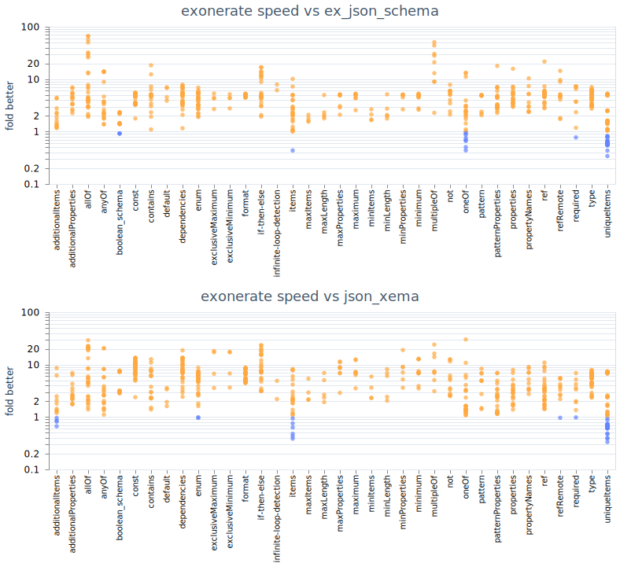

<!-- livebook:{"persist_outputs":true} -->

# Performance comparison of Exonerate to other schema libs

```elixir
Mix.install([
  {:jason, "> 0.0.0"},
  {:vega_lite, "~> 0.1.7"},
  {:kino_vega_lite, "~> 0.1.8"},
  {:benchee, "~> 1.1.0"},
  {:exonerate, "~> 0.3.0"}
])

~w(test.ex schema.ex)
|> Enum.each(fn file ->
  __DIR__
  |> Path.join("benchmark/#{file}")
  |> Code.compile_file()
end)

alias Benchmark.Schema
alias Benchmark.Test
```

## Benchmarking Accuracy

We're going to marshal our results into the following struct, which carries information for
visualization:

```elixir
defmodule Benchmark.Result do
  defstruct [
    :group,
    :schema,
    :test,
    :schema_complexity,
    :data_complexity,
    :exonerate,
    :ex_json_schema,
    :json_xema
  ]
end
```

```elixir
defmodule Benchmark do
  @omit ~w(definitions.json)

  alias Benchmark.Result

  @test_directory Path.join(__DIR__, "../test/_draft7")
  def load_results do
    @test_directory
    |> Schema.stream_from_directory(omit: @omit)
    |> load_files
    |> Enum.to_list()
  end

  defp load_files(schema_stream) do
    schema_stream
    |> Stream.flat_map(fn schema ->
      schema.tests
      |> Stream.map(fn test ->
        %Result{
          schema_complexity: complexity(schema.schema),
          data_complexity: complexity(test.data),
          group: schema.group,
          schema: schema.description,
          test: test.description
        }
      end)
      |> Stream.filter(&file_exists?/1)
      |> Stream.map(&load_data/1)
    end)
  end

  defp complexity(array) when is_list(array) do
    array
    |> Enum.map(&complexity/1)
    |> Enum.sum()
    |> Kernel.+(1)
  end

  defp complexity(object) when is_map(object) do
    object
    |> Enum.map(fn {_, v} -> complexity(v) end)
    |> Enum.sum()
    |> Kernel.+(1)
  end

  defp complexity(_), do: 1

  @result_dir Path.join(__DIR__, "results")
  defp filename(result), do: "#{result.group}-#{result.schema}-#{result.test}.bin"

  defp file_exists?(result) do
    path = Path.join(@result_dir, filename(result))
    File.exists?(path)
  end

  defp load_data(result) do
    data =
      @result_dir
      |> Path.join(filename(result))
      |> File.read!()
      |> :erlang.binary_to_term()
      |> Map.get(:scenarios)

    result
    |> load(data, :exonerate)
    |> load(data, :ex_json_schema)
    |> load(data, :json_xema)
  end

  defp load(result, data, tag) do
    if scenario = Enum.find(data, &(&1.name === "#{tag}")) do
      %{result | tag => scenario.run_time_data.statistics.ips}
    else
      result
    end
  end
end

bench_result = Benchmark.load_results()
:ok
```

```elixir
defmodule Benchmark.FullPlot do
  def break_up(result) do
    Enum.map(~w(exonerate ex_json_schema json_xema)a, fn lib ->
      result
      |> Map.take(~w(group schema test)a)
      |> Map.merge(%{
        library: lib,
        ips: Map.get(result, lib)
      })
    end)
  end

  def plot(data) do
    tabularized = Enum.flat_map(data, &break_up/1)

    VegaLite.new()
    |> VegaLite.data_from_values(tabularized)
    |> VegaLite.mark(:circle)
    |> VegaLite.encode_field(:x, "group", type: :nominal, title: false)
    |> VegaLite.encode_field(:y, "ips", type: :quantitative, title: "ips")
    |> VegaLite.encode_field(:color, "library")
    |> VegaLite.encode(:tooltip, [
      [field: "group"],
      [field: "schema"],
      [field: "test"]
    ])
  end
end

Benchmark.FullPlot.plot(bench_result)
```


```elixir
defmodule Benchmark.FoldBetter do
  defp fold(result = %{exonerate: ex_ips}, library) do
    List.wrap(
      if lib_ips = Map.get(result, library) do
        result
        |> Map.take(~w(group schema test)a)
        |> Map.put(:fold, ex_ips / lib_ips)
        |> Map.put(:color, ex_ips / lib_ips > 1)
      end
    )
  end

  defp plot_one(data, library) do
    tabularized = Enum.flat_map(data, &fold(&1, library))

    VegaLite.new(title: "exonerate speed vs #{library}")
    |> VegaLite.data_from_values(tabularized)
    |> VegaLite.mark(:circle)
    |> VegaLite.encode_field(:x, "group", type: :nominal, title: false)
    |> VegaLite.encode_field(:y, "fold",
      type: :quantitative,
      title: "fold better",
      scale: [type: :log]
    )
    |> VegaLite.encode_field(:color, "color", legend: false)
    |> VegaLite.encode(:tooltip, [
      [field: "group"],
      [field: "schema"],
      [field: "test"],
      [field: "fold"]
    ])
  end

  def plot(data) do
    VegaLite.new()
    |> VegaLite.concat(Enum.map(~w(ex_json_schema json_xema)a, &plot_one(data, &1)), :vertical)
  end
end

Benchmark.FoldBetter.plot(bench_result)
```

